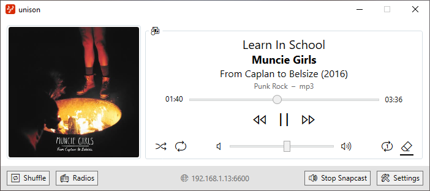

# unison

**unison** is a very simple [Music Player Daemon (MPD)](https://www.musicpd.org/) daemon client with the following goals:

* lightweight window that can be toggled with shortcuts
* music control through rebindable shortcuts
* [Snapcast](https://mjaggard.github.io/snapcast/) integration
* Radio stations

## Features

### Window

By default, unison works as a daemon in the taskbar system tray. You can display the main window when needed at any time with a shortcut.

### Shortcuts

You can control your music at anytime with the shortcuts. They are usable system-wide, even if the window is not visible. They are of course fully rebindable.

### Snapcast

Embedding a Snapcast client allows to listen to music on multiple devices. For example, if you music is on a distant server connected to speakers in your living room, you can still listen to it on your computer running unison with this integrated client.

### Radio stations

Through [Radio-Browser](https://www.radio-browser.info), a community database, you can play radio streams directly from unison. There are more than 28,000 stations recorded on this service, so it is a nice way to discover new music and cultures.

## Planned features

* A complete shuffle system based on set criteria, aka a smart playlist.
* Playlist, queue and library management. I use other software to do it, but I will implement them at some point.

## Translations

unison is translated in English, French and Spanish. You can contribute if you want!