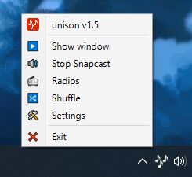

# unison

**unison** is a very simple [Music Player Daemon (MPD)](https://www.musicpd.org/) daemon client with the following goals:

* lightweight window that can be toggled with shortcuts
* music control through rebindable shortcuts
* [Snapcast](https://github.com/badaix/snapcast) integration
* radio stations
* basic shuffle system

## Features

### Window

By default, unison works as a daemon in the taskbar system tray. You can display the main window when needed at any time with a shortcut.

### Shortcuts

You can control your music at anytime with the shortcuts. They are usable system-wide, even if the window is not visible. They are of course fully rebindable.

### Snapcast

Embedding a Snapcast client allows to listen to music on multiple devices. For example, if you music is on a distant server connected to speakers in your living room, you can still listen to it on your computer running unison with this integrated client.

### Radio stations

Through [Radio-Browser](https://www.radio-browser.info), a community database, you can play radio streams directly from unison. There are more than 28,000 stations recorded on this service, so it is a nice way to discover new music and cultures.

### Shuffle system

A shuffle system is available, allowing you to only use unison as a (very basic) music manager. You can use filters to have a tailored shuffle experience.

## Translations

unison is translated in English, French and Spanish. You can contribute if you want!

## The future

This project started as a simple daemon to control my music with shortcuts, and a Snapcast player. With time, I added a few useful features, while learning C# and WPF. I wanted to make a complete implementation of MPD features (library, playlist, queue management, etc). However, this will probably not happen. Indeed, I have been waiting a few years for Microsoft to settle on a modern implementation of its user interface framework. But it is still not there, and I do not want to spend time for a technology that might die too quickly. There's no coherence in Windows' interfaces, and it is not really motivating. I also want to be able to play Snapcast from iOS, so I think I will most likely invest (natively) my time in this platform for the foreseeable future.

If I were to continue, the first thing to do would be to make a single window interface, by making a real MVVP implementation, and not one depending on windows like I did here, by iterating on a single program that has become a bit too big to not separate logic from visual.

I still plan on maintaining this app in a working state, as its working great as is. But I do not intend, for the time being at least, to make dramatic changes as I would have liked to.